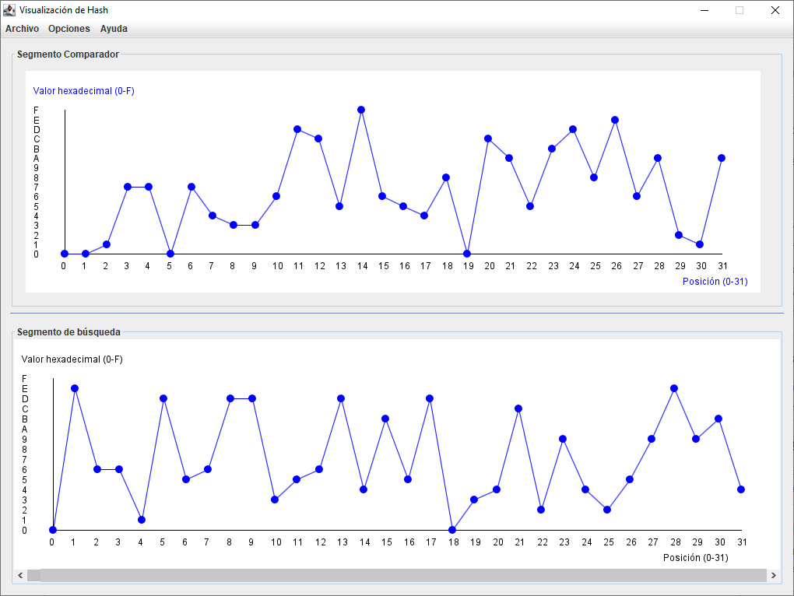

# Grafica un HASH
Muestra de forma gráfica como se ve un HASH en un eje de coordenadas a partir de sus valores hexadecimales y sus posiciones. 

# Que puede hacer
* Graficar un HASH.
* Graficar cualquier fichero.
* Buscar un patron y obtener su ubicación en la gráfica.
(Implementa una búsqueda por <b>Knuth-Morris-Pratt (KMP)</b> con tolerancia de valores (+1, -1, igual)).

* Implementa un sistema de ventana para visualizar en tiempo real la gráfica.

# Por hacer
* Mejorar la UI.
* Optimizar el código.
* Completar las funciones Nueva Sesión, Guardar Sesión y Cargar sesión.
* Encontrar una función que pueda generar un gráfico similar al obtenido.
* Mostrar la función obtenida.
* Reflejar debajo de la gráfica original, el resultado de la función obtenida e inferir datos.
  
# Demostración de un caso de prueba: 
<b>HASH: 3e4f2a7d9b0c1e8f6d4a3b2c5e1f0d9a</b> 
<b>Resultado: </b>

# Interfaz gráfica

  
# Utilidades
Por definir aún, aunque debe servir para algo la hora y media dedicada en hacerlo.
