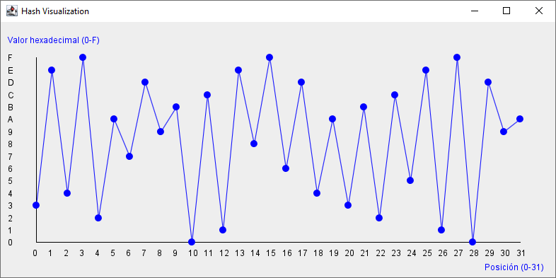

# Grafica un HASH
Muestra de forma gráfica como se ve un HASH en una gráfica de posiciones. 

# Por hacer
* Encontrar una función que pueda generar un gráfico similar al obtenido.
* Mostrar la función obtenida.
* Reflejar debajo de la gráfica original, el resultado de la función obtenida e inferir datos.

# Demostración de un caso de prueba: 
<b>HASH: 3e4f2a7d9b0c1e8f6d4a3b2c5e1f0d9a</b> 
<b>Resultado: </b>

  
